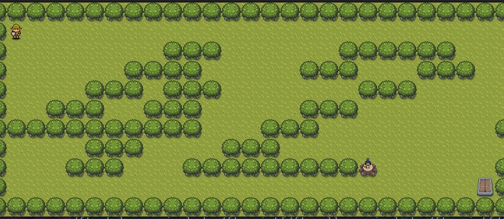

# So Long - The Legend of Zelda Edition

Um jogo 2D inspirado em The Legend of Zelda, desenvolvido em C usando a biblioteca gráfica MiniLibX como projeto da 42 School.


## 🎮 Demo



## 📋 Índice

- [Sobre o Projeto](#sobre-o-projeto)
- [Características](#características)
- [Requisitos](#requisitos)
- [Instalação](#instalação)
- [Como Jogar](#como-jogar)
- [Estrutura do Projeto](#estrutura-do-projeto)
- [Formato dos Mapas](#formato-dos-mapas)
- [Detalhes Técnicos](#detalhes-técnicos)

## 🎮 Sobre o Projeto

**So Long** é um jogo 2D onde o jogador controla Link em um labirinto. O objetivo é coletar todos os itens colecionáveis e alcançar a saída com o menor número de movimentos possível.

O projeto faz parte do currículo da 42 School e tem como objetivo ensinar:
- Manipulação de janelas e eventos gráficos
- Renderização de sprites e animações
- Lógica de jogo e validação de mapas
- Gerenciamento de memória em C

## ✨ Características

- **Animações suaves**: Sistema de animação baseado em tempo real (150ms por frame)
- **Intro animada**: Sequência de introdução com logo animado
- **Sprites temáticos**: Visual inspirado em The Legend of Zelda
- **Validação de mapas**: Sistema robusto que verifica:
  - Paredes circundando o mapa
  - Presença de player, saída e colecionáveis
  - Caminho válido para completar o jogo (DFS)
- **Contador de movimentos**: Exibido na janela e no terminal
- **Múltiplas direções**: Animações para 4 direções (cima, baixo, esquerda, direita)

## 📦 Requisitos

### Sistema Operacional
- Linux (testado no Ubuntu)

### Dependências
```bash
sudo apt-get update
sudo apt-get install -y build-essential libx11-dev libxext-dev libbsd-dev
```

### Ferramentas
- GCC ou Clang
- Make
- Git

## 🚀 Instalação

### 1. Clone o repositório
```bash
git clone git@github.com:Solractys/so_long.git
cd so_long
```

### 2. Compile o projeto
```bash
make
```

O comando `make` irá:
- Compilar a biblioteca MiniLibX
- Compilar todos os arquivos fonte
- Gerar o executável `so_long`

### 3. Execute o jogo
```bash
./so_long maps/map.ber
```

## 🎯 Como Jogar

### Controles
- **W** ou **↑**: Mover para cima
- **S** ou **↓**: Mover para baixo
- **A** ou **←**: Mover para esquerda
- **D** ou **→**: Mover para direita
- **ESC**: Sair do jogo

### Objetivo
1. Colete todos os itens colecionáveis (rupias/cristais)
2. Vá até a saída (porta)
3. Complete o nível com o menor número de movimentos

### Regras
- Você não pode atravessar paredes
- A saída só abre após coletar todos os itens
- Cada movimento é contado e exibido

## 📁 Estrutura do Projeto

```
so_long/
├── includes/
│   ├── game.h              # Estruturas e funções do jogo
│   ├── intro.h             # Sistema de intro animada
│   ├── map.h               # Validação e leitura de mapas
│   ├── render.h            # Renderização de sprites
│   ├── so_long.h           # Header principal
│   └── ft_printf/          # Printf customizado
├── src/
│   ├── game/
│   │   ├── game_init.c     # Inicialização do jogo
│   │   ├── game_loop.c     # Loop principal com controle de FPS
│   │   ├── game_win.c      # Lógica de vitória
│   │   ├── movements.c     # Sistema de movimentação
│   │   └── end_game.c      # Cleanup e finalização
│   ├── intro/
│   │   └── intro.c         # Animação de introdução
│   ├── map/
│   │   ├── check_path.c    # Validação de caminho (DFS)
│   │   ├── gnl/            # Get Next Line
│   │   └── [outros]        # Leitura e validação de mapas
│   ├── render/
│   │   └── render.c        # Renderização de tiles e sprites
│   ├── assets/             # Sprites (.xpm)
│   │   ├── intro/          # Frames da intro
│   │   ├── player/         # Animações do jogador
│   │   ├── collectibles/   # Itens colecionáveis
│   │   └── environment/    # Chão, paredes, saída
│   └── main.c              # Entry point
├── maps/                   # Mapas de exemplo
├── minilibx/               # Biblioteca gráfica MiniLibX
└── Makefile
```

## 🗺️ Formato dos Mapas

Os mapas são arquivos de texto com extensão `.ber` compostos pelos seguintes caracteres:

| Caractere | Significado |
|-----------|-------------|
| `1` | Parede |
| `0` | Espaço vazio |
| `P` | Posição inicial do jogador |
| `C` | Colecionável (rupia/cristal) |
| `E` | Saída |

### Regras para mapas válidos
- Deve ser retangular
- Deve estar cercado por paredes (`1`)
- Deve conter exatamente 1 jogador (`P`)
- Deve conter exatamente 1 saída (`E`)
- Deve conter pelo menos 1 colecionável (`C`)
- Deve haver um caminho válido do jogador até todos os colecionáveis e a saída

### Exemplo de mapa válido
```
1111111111
1P00000001
1011100001
100C100001
1011100101
1000001E01
1111111111
```

## 🔧 Detalhes Técnicos

### Sistema de Animação
O jogo utiliza um sistema de animação baseado em tempo real:
- **FPS independente**: Usa `gettimeofday()` para controle de tempo
- **150ms por frame**: Cada sprite anima a cada 150 milissegundos
- **6 frames por animação**: Grama, colecionáveis e jogador
- **Game loop eficiente**: `mlx_loop_hook()` para atualizações contínuas

### Arquitetura
```c
typedef struct s_game {
    void    *mlx;                  // Conexão MLX
    void    *win;                  // Janela
    t_map   *map;                  // Dados do mapa
    void    *player_img[4][6];     // Sprites do jogador (4 direções, 6 frames)
    void    *floor_img[6];         // Animação do chão
    void    *collectible_img[6];   // Animação dos colecionáveis
    void    *wall_img;             // Parede
    void    *exit_img;             // Saída
    int     grass_frame;           // Frame atual da grama
    int     collectible_frame;     // Frame atual dos colecionáveis
    int     player_frame;          // Frame atual do jogador
    long    last_frame_time;       // Timestamp do último frame
    int     moves;                 // Contador de movimentos
    int     player_direction;      // Direção atual (0-3)
    int     exit_status;           // Status de saída
} t_game;
```

### Algoritmo de Validação: Flood Fill (DFS)

O projeto implementa um **Flood Fill** usando **Depth-First Search (DFS)** para validar se o mapa tem solução possível antes de iniciar o jogo.

#### Como Funciona

1. **Cópia do Mapa Original**
   ```c
   t_map *map_copy = copy_map(map);
   ```
   - Cria uma cópia profunda do mapa para não modificar o original
   - Permite testar o caminho sem afetar o jogo

2. **Execução do DFS**
   ```c
   void dfs(t_map *map, int x, int y)
   {
       // Verifica limites do mapa
       if (x < 0 || x >= map->height || y < 0 || y >= map->width)
           return;
       
       // Para se encontrar parede ou célula já visitada
       if (map->map[x][y] == '1' || map->map[x][y] == 'V')
           return;
       
       // Marca célula como visitada
       map->map[x][y] = 'V';
       
       // Explora recursivamente as 4 direções
       dfs(map, x + 1, y);  // Baixo
       dfs(map, x - 1, y);  // Cima
       dfs(map, x, y + 1);  // Direita
       dfs(map, x, y - 1);  // Esquerda
   }
   ```

3. **Início da Busca**
   - Começa na posição inicial do jogador (`P`)
   - Propaga-se por todas as células alcançáveis
   - Marca cada célula visitada com `'V'`

4. **Validação dos Resultados**
   ```c
   // Verifica se todos os colecionáveis foram visitados
   if (collectibles_left != 0)
       return INVALID;
   
   // Verifica se a saída foi alcançada
   if (map_copy->map[exit_y][exit_x] != 'V')
       return INVALID;
   ```

#### Exemplo Visual

**Mapa Original:**
```
1111111111
1P00000001    P = Jogador
1011100001    C = Colecionável
100C100001    E = Saída
1011100101    1 = Parede
1000001E01    0 = Chão
1111111111
```

**Após DFS (células visitadas = V):**
```
1111111111
1VVVVVVVV1    ✓ Jogador alcança todos os espaços
1V1110VVV1    ✓ Colecionável foi visitado
1VVVVVVVV1    ✓ Saída foi alcançada
1V1110V1V1    ✓ Mapa VÁLIDO
1VVVVV1VV1
1111111111
```

#### Casos de Falha

**Exemplo de mapa INVÁLIDO (saída bloqueada):**
```
111111
1P0001     Parede bloqueia caminho até E
111001     DFS não consegue alcançar a saída
100E01     ✗ Mapa INVÁLIDO
111111
```

#### Complexidade
- **Tempo**: O(n × m) - visita cada célula uma vez
- **Espaço**: O(n × m) - cópia do mapa + pilha de recursão
  - n = altura do mapa
  - m = largura do mapa

#### Vantagens desta Implementação
- ✅ Detecta mapas impossíveis antes do jogo começar
- ✅ Evita frustrações do jogador com mapas sem solução
- ✅ Recursão natural e código limpo
- ✅ Não modifica o mapa original (usa cópia)

### Comandos Make
```bash
make        # Compila o projeto
make clean  # Remove arquivos objeto
make fclean # Remove arquivos objeto e executável
make re     # Recompila do zero
```

## 🎨 Assets
Todos os sprites estão no formato XPM e têm 32x32 pixels, organizados em:
- **Intro**: 7 frames animados
- **Player**: 4 direções × 6 frames = 24 sprites
- **Colecionáveis**: 6 frames
- **Grama**: 6 frames
- **Paredes e saída**: Sprites estáticos

## 📝 Licença
Este é um projeto educacional da 42 School.

## 👨‍💻 Autor
Desenvolvido por **csilva-s** ([@Solractys](https://github.com/Solractys))

---

**Enjoy the game! 🎮✨**
